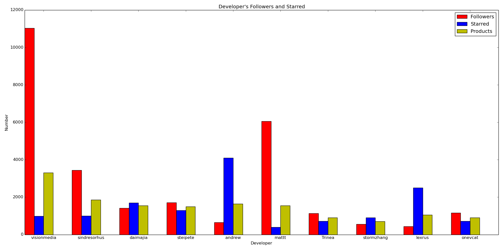
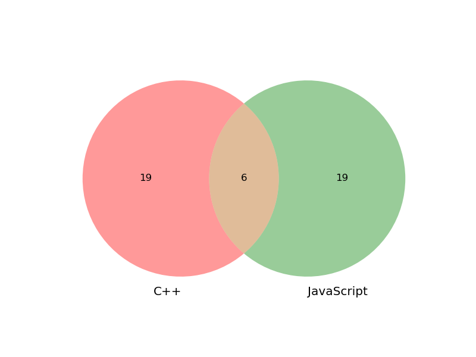

# The Most Influential Developers on Github -- Github Data Challenge 2014

There are many developers on Github, following influential developers is highly beneficial because they usually spread promising repositories.
You might agree the influential developers have the powers to promote repositories on Github by starring, their followers may star successively.
This survey employed the well-known PageRank algorithm, the data of watching events from the [GitHub Archive](http://www.githubarchive.org/) and users' following relationships from the Github API to mine the most influential developers on Github.

## Disclaimer
The result is based on limited data (2014/1/1 ~ 2014/8/26) and not on behalf of Github. The rank might be changed in case the collected data increased.

## The Result
* [Top 25 Influential Developers in General](#top-general)
* [Top 25 Influential Developers in Python](#top-python)
* [Top 25 Influential Developers in JavaScript](#top-js)
* [Top 25 Influential Developers in Go](#top-go)
* [Top 25 Influential Developers in Ruby](#top-ruby)
* [Top 25 Influential Developers in PHP](#top-php)
* [Top 25 Influential Developers in Perl](#top-perl)
* [Top 25 Influential Developers in CSS](#top-css)
* [Top 25 Influential Developers in C](#top-c)
* [Top 25 Influential Developers in C++](#top-cplusplus)
* [Top 25 Influential Developers in Java](#top-java)
* [Top 25 Influential Developers in C#](#top-csharp)
* [Top 25 Influential Developers in Objective-C](#top-objc)
* [Top 25 Influential Developers in Swift](#top-swift)
* [Top 25 Influential Developers in Haskell](#top-haskell)
* [Top 25 Influential Developers in Scala](#top-scala)
* [Top 25 Influential Developers in Clojure](#top-clojure)
* [Top 25 Influential Developers in Erlang](#top-erlang)

## Data Collection
The watching events data were collected from the [GitHub Archive](http://www.githubarchive.org/) from 2014/1/1 to 2014/8/26, the repository's name, the actor's name and the event issued time were extracted respectively. The users' following relationships were collected from the Github API.
To collect the data, issuing `python task_grab_watch_events`. Please make sure the MongoDB has already started, this task will create a database named `github`.

### Github API User Login
Since the task consumes the Github API, please add robots' login names and passwords respectively in the `config.py` under the same directory.

## Build Graphs
To build graphs, please make sure the watch events have already collected to MongoDB and issue `python task_gen_events_graphs`.
Every repository's watching event can be represented a 3-tuple vertex likes (event's created time, repository's name, actor's name), each vertex has directed edges with its following users' watching events formed vertices who are also stargazers of the repository but prior to the user, in the other words, a graph represents the cascade of a repository's watching events. The whole Github's repositories' watching events form many graphs.
In addition, the owner of the repository also has edges from the followers who starred the repository to capture the influence of open source.

### Edge Weighting
Suppose the actor has less possibility to influence followers by time, to diminish the influence by time, the edges are weighted by a Fibonacci function, `1.0 / fib(interval + 2)`, the `fib` is the [Fibonacci series](http://en.wikipedia.org/wiki/Fibonacci_number) from 0 and the unit of interval is a day. Longer the events' interval, lesser the connection is between events.

## Calculate the Influence
Issue `python task_cal_pagerank` then `python task_cal_influence`.
We can score the influence among users by PageRank since the cascade of watching events can be represented as a directed graph, and so forth we can get the influence of a user by combining scores which are the user got from involved graphs. To reduce noise, the score equals the unit `1` were removed before combining.

### PageRank
[PageRank](http://en.wikipedia.org/wiki/PageRank) is a link analysis algorithm and it assigns a numerical weight to each element of a hyperlinked set of documents, such as the World Wide Web, with the purpose of "measuring" its relative importance within the set.
In this survey, the elements are of the watching events and the links are of the following relationship among actors.

### Normalized PageRank
Since the original PageRank is specific to a single graph, we have to find a way to combine PageRanks from multiple graphs, that is, the PageRank have to be normalized. The PageRank can be normalized by dividing the original PageRank by the least PageRank.
There is a gentle introduction to the [Normalized PageRank](https://people.mpi-inf.mpg.de/~kberberi/presentations/2007-www2007.pdf).

### Classification by Language
Besides of the ranking in general, we can consider ranking by language since Github API can provide the metadata which includes the language of repository, and then we can only display the PageRank algorithm on selected repositories which are of the same language. However, the result might not very make sense due to the naive classification of languages.

## Integrated Process
To gain better performance, using `python task_gen_events_graphs-cal_pagerank-cal_influence.py` for integrating the processes from `task_gen_events_graphs` to `task_cal_influence`.

## Result Analysis
### Histogram of Top 10 in General

Our goal is measuring the total influence of the star, and the maximum of a user's direct influencing stars is `(starred + repos) * followers` where the `repos` stands for the user's number of public repository, so the products can help to analyze the performance of our method. To make the histogram more readable, the products are square root of product indeed. To get this histogram, issuing `python task_draw_histogram General` after calculating the influence.
According to the histogram, the gradient of the products is falling, the PageRank method works!

## Data Insights
### Evolving Graph Animation
Evolving graph animation captures the time series of watching events and their connections, we can then analyze the compactness of a repository's community by observing the forming clusters from animation. The animation was made of one frame per hour of the timeline, collapsing the gap of no event. To make the animation, issuing `python task_draw_graphs {repository's full name}`.

#### Observing the Growth of a Popular Repository

The popular repository [josephmisiti/awesome-machine-learning](https://github.com/josephmisiti/awesome-machine-learning) was created at `2014-07-15T19:11:19Z`, so the animation can cover its growth. The clusters in the graph might be communities, we can find that there is a main cluster in the center, growing up with the passage of time. There are some frames that most parts of the graph grew up simultaneously perhaps from spread outside the Github.

#### Fabrication Detection

The [sebyddd/YouAreAwesome](https://github.com/sebyddd/YouAreAwesome) was found because of its strange presentation. It was created at `2014-08-18T18:50:57Z` with an accompanying post [How to get #1 trending on GitHub or ”GitHub’s security flaws”](https://medium.com/@sebyddd/how-to-get-1-trending-on-github-or-githubs-security-flaws-9f132ab7474f), according to the post, the stargazers were fabrications and was bursting at the time. We can observe some clues from the animation: the animation is much shorter than [josephmisiti/awesome-machine-learning](https://github.com/josephmisiti/awesome-machine-learning) beacuse of the burst, and it lacks scattered clusters due to the stargazers were fabrications without natural connections.

### Community Overlapping
#### NodeJS Community Overlaps on C++ and JavaScript

The Venn diagram of top 25 in C++ and Javascript has an order 6 intersection because many repositories for NodeJS were created by C++, one can review the developers in the intersection to realize the fact. The intersection contains [mcollina](https://github.com/mcollina), [jeresig](https://github.com/jeresig), [sindresorhus](https://github.com/sindresorhus), [hughsk](https://github.com/hughsk), [andrew](https://github.com/andrew) and [visionmedia](https://github.com/visionmedia).

## Software Prerequisites
* [Python 2.7](https://www.python.org/)
* [MongoDB 2.6](http://www.gevent.org/)
* [PyMongo 2.7](http://api.mongodb.org/python/current/)
* [PyGithub 1.25](http://jacquev6.github.io/PyGithub/v1/introduction.html)
* [graph-tool 2.2](http://graph-tool.skewed.de/)
* [matplotlib 1.4](http://matplotlib.org/)
* [matplotlib-venn](https://github.com/konstantint/matplotlib-venn)
* [Gevent](http://www.gevent.org/)
* [urlgrabber](http://urlgrabber.baseurl.org/)
* [lxml](http://lxml.de/)
* [underscore.py](http://serkanyersen.github.io/underscore.py/)
* [funcy](https://github.com/Suor/funcy)
* [more-itertools](https://pythonhosted.org/more-itertools/api.html)
* [arrow](http://crsmithdev.com/arrow/)

##  Top 25 Influential Developers in General
1. [visionmedia](https://github.com/visionmedia)
2. [sindresorhus](https://github.com/sindresorhus)
3. [mattt](https://github.com/mattt)
4. [steipete](https://github.com/steipete)
5. [daimajia](https://github.com/daimajia)
6. [andrew](https://github.com/andrew)
7. [JakeWharton](https://github.com/JakeWharton)
8. [Trinea](https://github.com/Trinea)
9. [substack](https://github.com/substack)
10. [onevcat](https://github.com/onevcat)
11. [lexrus](https://github.com/lexrus)
12. [stormzhang](https://github.com/stormzhang)
13. [turingou](https://github.com/turingou)
14. [myell0w](https://github.com/myell0w)
15. [youxiachai](https://github.com/youxiachai)
16. [addyosmani](https://github.com/addyosmani)
17. [igrigorik](https://github.com/igrigorik)
18. [jeresig](https://github.com/jeresig)
19. [MatthewMueller](https://github.com/MatthewMueller)
20. [ManuelPeinado](https://github.com/ManuelPeinado)
21. [juliangruber](https://github.com/juliangruber)
22. [mattn](https://github.com/mattn)
23. [azu](https://github.com/azu)
24. [romaonthego](https://github.com/romaonthego)
25. [xhzengAIB](https://github.com/xhzengAIB)

##  Top 25 Influential Developers in Python
1. [kennethreitz](https://github.com/kennethreitz)
2. [mitsuhiko](https://github.com/mitsuhiko)
3. [rochacbruno](https://github.com/rochacbruno)
4. [avelino](https://github.com/avelino)
5. [jezdez](https://github.com/jezdez)
6. [lepture](https://github.com/lepture)
7. [visionmedia](https://github.com/visionmedia)
8. [pydanny](https://github.com/pydanny)
9. [saghul](https://github.com/saghul)
10. [vinta](https://github.com/vinta)
11. [clowwindy](https://github.com/clowwindy)
12. [dahlia](https://github.com/dahlia)
13. [fengmk2](https://github.com/fengmk2)
14. [tangqiaoboy](https://github.com/tangqiaoboy)
15. [jd](https://github.com/jd)
16. [numbbbbb](https://github.com/numbbbbb)
17. [osantana](https://github.com/osantana)
18. [ionelmc](https://github.com/ionelmc)
19. [jefftriplett](https://github.com/jefftriplett)
20. [tonyseek](https://github.com/tonyseek)
21. [Zulko](https://github.com/Zulko)
22. [reduxionist](https://github.com/reduxionist)
23. [turingou](https://github.com/turingou)
24. [ellisonleao](https://github.com/ellisonleao)
25. [dcramer](https://github.com/dcramer)

##  Top 25 Influential Developers in JavaScript
1. [visionmedia](https://github.com/visionmedia)
2. [sindresorhus](https://github.com/sindresorhus)
3. [substack](https://github.com/substack)
4. [turingou](https://github.com/turingou)
5. [andrew](https://github.com/andrew)
6. [MatthewMueller](https://github.com/MatthewMueller)
7. [juliangruber](https://github.com/juliangruber)
8. [jeresig](https://github.com/jeresig)
9. [addyosmani](https://github.com/addyosmani)
10. [maxogden](https://github.com/maxogden)
11. [paulirish](https://github.com/paulirish)
12. [studiomohawk](https://github.com/studiomohawk)
13. [azu](https://github.com/azu)
14. [cheeaun](https://github.com/cheeaun)
15. [feross](https://github.com/feross)
16. [mathiasbynens](https://github.com/mathiasbynens)
17. [mafintosh](https://github.com/mafintosh)
18. [TooTallNate](https://github.com/TooTallNate)
19. [yyx990803](https://github.com/yyx990803)
20. [mcollina](https://github.com/mcollina)
21. [fengmk2](https://github.com/fengmk2)
22. [hughsk](https://github.com/hughsk)
23. [ianstormtaylor](https://github.com/ianstormtaylor)
24. [igrigorik](https://github.com/igrigorik)
25. [hakimel](https://github.com/hakimel)

##  Top 25 Influential Developers in Go
1. [visionmedia](https://github.com/visionmedia)
2. [mattn](https://github.com/mattn)
3. [dgryski](https://github.com/dgryski)
4. [Unknwon](https://github.com/Unknwon)
5. [codegangsta](https://github.com/codegangsta)
6. [rakyll](https://github.com/rakyll)
7. [daaku](https://github.com/daaku)
8. [igrigorik](https://github.com/igrigorik)
9. [bradfitz](https://github.com/bradfitz)
10. [c4milo](https://github.com/c4milo)
11. [mitchellh](https://github.com/mitchellh)
12. [astaxie](https://github.com/astaxie)
13. [lunny](https://github.com/lunny)
14. [spf13](https://github.com/spf13)
15. [mreiferson](https://github.com/mreiferson)
16. [andrew](https://github.com/andrew)
17. [philips](https://github.com/philips)
18. [crosbymichael](https://github.com/crosbymichael)
19. [fatih](https://github.com/fatih)
20. [samuel](https://github.com/samuel)
21. [codahale](https://github.com/codahale)
22. [pengwynn](https://github.com/pengwynn)
23. [michaelhood](https://github.com/michaelhood)
24. [armon](https://github.com/armon)
25. [takuan-osho](https://github.com/takuan-osho)

##  Top 25 Influential Developers in Ruby
1. [ankane](https://github.com/ankane)
2. [mattt](https://github.com/mattt)
3. [andrew](https://github.com/andrew)
4. [JuanitoFatas](https://github.com/JuanitoFatas)
5. [igrigorik](https://github.com/igrigorik)
6. [goshakkk](https://github.com/goshakkk)
7. [hsbt](https://github.com/hsbt)
8. [amatsuda](https://github.com/amatsuda)
9. [chloerei](https://github.com/chloerei)
10. [josh](https://github.com/josh)
11. [flyerhzm](https://github.com/flyerhzm)
12. [huacnlee](https://github.com/huacnlee)
13. [fgrehm](https://github.com/fgrehm)
14. [futoase](https://github.com/futoase)
15. [defunkt](https://github.com/defunkt)
16. [rkh](https://github.com/rkh)
17. [parkr](https://github.com/parkr)
18. [joker1007](https://github.com/joker1007)
19. [ryanb](https://github.com/ryanb)
20. [pengwynn](https://github.com/pengwynn)
21. [mitchellh](https://github.com/mitchellh)
22. [kenn](https://github.com/kenn)
23. [r7kamura](https://github.com/r7kamura)
24. [maccman](https://github.com/maccman)
25. [takkanm](https://github.com/takkanm)

##  Top 25 Influential Developers in PHP
1. [GrahamCampbell](https://github.com/GrahamCampbell)
2. [sebastianbergmann](https://github.com/sebastianbergmann)
3. [fabpot](https://github.com/fabpot)
4. [Ocramius](https://github.com/Ocramius)
5. [vojtech-dobes](https://github.com/vojtech-dobes)
6. [msurguy](https://github.com/msurguy)
7. [barryvdh](https://github.com/barryvdh)
8. [JeffreyWay](https://github.com/JeffreyWay)
9. [philsturgeon](https://github.com/philsturgeon)
10. [nikic](https://github.com/nikic)
11. [laracasts](https://github.com/laracasts)
12. [lsmith77](https://github.com/lsmith77)
13. [panique](https://github.com/panique)
14. [phalcon](https://github.com/phalcon)
15. [Zauberfisch](https://github.com/Zauberfisch)
16. [taylorotwell](https://github.com/taylorotwell)
17. [dg](https://github.com/dg)
18. [igorw](https://github.com/igorw)
19. [pminnieur](https://github.com/pminnieur)
20. [harikt](https://github.com/harikt)
21. [cfoellmann](https://github.com/cfoellmann)
22. [Ph3nol](https://github.com/Ph3nol)
23. [pippinsplugins](https://github.com/pippinsplugins)
24. [jasonlewis](https://github.com/jasonlewis)
25. [Anahkiasen](https://github.com/Anahkiasen)

##  Top 25 Influential Developers in Perl
1. [tokuhirom](https://github.com/tokuhirom)
2. [kraih](https://github.com/kraih)
3. [miyagawa](https://github.com/miyagawa)
4. [moznion](https://github.com/moznion)
5. [DHowett](https://github.com/DHowett)
6. [visionmedia](https://github.com/visionmedia)
7. [turingou](https://github.com/turingou)
8. [agentzh](https://github.com/agentzh)
9. [lulzlabs](https://github.com/lulzlabs)
10. [kazeburo](https://github.com/kazeburo)
11. [ingydotnet](https://github.com/ingydotnet)
12. [skx](https://github.com/skx)
13. [brendangregg](https://github.com/brendangregg)
14. [gugod](https://github.com/gugod)
15. [jberger](https://github.com/jberger)
16. [sjackman](https://github.com/sjackman)
17. [oetiker](https://github.com/oetiker)
18. [rjbs](https://github.com/rjbs)
19. [pjf](https://github.com/pjf)
20. [naoya](https://github.com/naoya)
21. [goccy](https://github.com/goccy)
22. [hirose31](https://github.com/hirose31)
23. [mattn](https://github.com/mattn)
24. [wireghoul](https://github.com/wireghoul)
25. [jonreid](https://github.com/jonreid)

##  Top 25 Influential Developers in CSS
1. [mdo](https://github.com/mdo)
2. [sindresorhus](https://github.com/sindresorhus)
3. [addyosmani](https://github.com/addyosmani)
4. [andrew](https://github.com/andrew)
5. [zenorocha](https://github.com/zenorocha)
6. [mrmrs](https://github.com/mrmrs)
7. [visionmedia](https://github.com/visionmedia)
8. [sahat](https://github.com/sahat)
9. [turingou](https://github.com/turingou)
10. [jxnblk](https://github.com/jxnblk)
11. [gabrielecirulli](https://github.com/gabrielecirulli)
12. [jeresig](https://github.com/jeresig)
13. [umaar](https://github.com/umaar)
14. [daneden](https://github.com/daneden)
15. [csswizardry](https://github.com/csswizardry)
16. [mreiferson](https://github.com/mreiferson)
17. [sofish](https://github.com/sofish)
18. [youxiachai](https://github.com/youxiachai)
19. [necolas](https://github.com/necolas)
20. [daimajia](https://github.com/daimajia)
21. [vitorbritto](https://github.com/vitorbritto)
22. [studiomohawk](https://github.com/studiomohawk)
23. [goshakkk](https://github.com/goshakkk)
24. [joewalnes](https://github.com/joewalnes)
25. [cheeaun](https://github.com/cheeaun)

##  Top 25 Influential Developers in C
1. [torvalds](https://github.com/torvalds)
2. [cloudwu](https://github.com/cloudwu)
3. [visionmedia](https://github.com/visionmedia)
4. [mattn](https://github.com/mattn)
5. [antirez](https://github.com/antirez)
6. [julycoding](https://github.com/julycoding)
7. [igrigorik](https://github.com/igrigorik)
8. [jwerle](https://github.com/jwerle)
9. [c9s](https://github.com/c9s)
10. [steipete](https://github.com/steipete)
11. [laruence](https://github.com/laruence)
12. [andrew](https://github.com/andrew)
13. [huangz1990](https://github.com/huangz1990)
14. [phalcon](https://github.com/phalcon)
15. [clowwindy](https://github.com/clowwindy)
16. [cloudhead](https://github.com/cloudhead)
17. [mattt](https://github.com/mattt)
18. [saghul](https://github.com/saghul)
19. [r-lyeh](https://github.com/r-lyeh)
20. [winocm](https://github.com/winocm)
21. [tmm1](https://github.com/tmm1)
22. [orangeduck](https://github.com/orangeduck)
23. [Constellation](https://github.com/Constellation)
24. [pengwynn](https://github.com/pengwynn)
25. [Trinea](https://github.com/Trinea)

##  Top 25 Influential Developers in C++
1. [jeresig](https://github.com/jeresig)
2. [rogerwang](https://github.com/rogerwang)
3. [r-lyeh](https://github.com/r-lyeh)
4. [osteele](https://github.com/osteele)
5. [zcbenz](https://github.com/zcbenz)
6. [jwerle](https://github.com/jwerle)
7. [sindresorhus](https://github.com/sindresorhus)
8. [fabpot](https://github.com/fabpot)
9. [satoruhiga](https://github.com/satoruhiga)
10. [andrew](https://github.com/andrew)
11. [ideawu](https://github.com/ideawu)
12. [BYVoid](https://github.com/BYVoid)
13. [hughsk](https://github.com/hughsk)
14. [vczh](https://github.com/vczh)
15. [hij1nx](https://github.com/hij1nx)
16. [chenshuo](https://github.com/chenshuo)
17. [visionmedia](https://github.com/visionmedia)
18. [kylemcdonald](https://github.com/kylemcdonald)
19. [patriciogonzalezvivo](https://github.com/patriciogonzalezvivo)
20. [youxiachai](https://github.com/youxiachai)
21. [mcollina](https://github.com/mcollina)
22. [creationix](https://github.com/creationix)
23. [eugeneware](https://github.com/eugeneware)
24. [JacksonTian](https://github.com/JacksonTian)
25. [indutny](https://github.com/indutny)

##  Top 25 Influential Developers in Java
1. [daimajia](https://github.com/daimajia)
2. [JakeWharton](https://github.com/JakeWharton)
3. [Trinea](https://github.com/Trinea)
4. [stormzhang](https://github.com/stormzhang)
5. [ManuelPeinado](https://github.com/ManuelPeinado)
6. [jgilfelt](https://github.com/jgilfelt)
7. [dodola](https://github.com/dodola)
8. [jpardogo](https://github.com/jpardogo)
9. [youxiachai](https://github.com/youxiachai)
10. [kyze8439690](https://github.com/kyze8439690)
11. [chrisbanes](https://github.com/chrisbanes)
12. [mcxiaoke](https://github.com/mcxiaoke)
13. [soarcn](https://github.com/soarcn)
14. [flavienlaurent](https://github.com/flavienlaurent)
15. [baoyongzhang](https://github.com/baoyongzhang)
16. [sd6352051](https://github.com/sd6352051)
17. [snowdream](https://github.com/snowdream)
18. [castorflex](https://github.com/castorflex)
19. [hotchemi](https://github.com/hotchemi)
20. [romannurik](https://github.com/romannurik)
21. [pedrovgs](https://github.com/pedrovgs)
22. [vbauer](https://github.com/vbauer)
23. [nostra13](https://github.com/nostra13)
24. [RomainPiel](https://github.com/RomainPiel)
25. [johnkil](https://github.com/johnkil)

##  Top 25 Influential Developers in C&#35;
1. [shanselman](https://github.com/shanselman)
2. [tugberkugurlu](https://github.com/tugberkugurlu)
3. [jamesmontemagno](https://github.com/jamesmontemagno)
4. [paulcbetts](https://github.com/paulcbetts)
5. [prime31](https://github.com/prime31)
6. [madskristensen](https://github.com/madskristensen)
7. [robconery](https://github.com/robconery)
8. [filipw](https://github.com/filipw)
9. [keijiro](https://github.com/keijiro)
10. [leekelleher](https://github.com/leekelleher)
11. [Haacked](https://github.com/Haacked)
12. [pierceboggan](https://github.com/pierceboggan)
13. [Cheesebaron](https://github.com/Cheesebaron)
14. [migueldeicaza](https://github.com/migueldeicaza)
15. [ayende](https://github.com/ayende)
16. [davidfowl](https://github.com/davidfowl)
17. [mythz](https://github.com/mythz)
18. [yreynhout](https://github.com/yreynhout)
19. [Rohansi](https://github.com/Rohansi)
20. [Chandu](https://github.com/Chandu)
21. [adamralph](https://github.com/adamralph)
22. [neuecc](https://github.com/neuecc)
23. [punker76](https://github.com/punker76)
24. [UnityPatterns](https://github.com/UnityPatterns)
25. [daimajia](https://github.com/daimajia)

##  Top 25 Influential Developers in Objective-C
1. [steipete](https://github.com/steipete)
2. [mattt](https://github.com/mattt)
3. [myell0w](https://github.com/myell0w)
4. [onevcat](https://github.com/onevcat)
5. [lexrus](https://github.com/lexrus)
6. [xhzengAIB](https://github.com/xhzengAIB)
7. [romaonthego](https://github.com/romaonthego)
8. [jessesquires](https://github.com/jessesquires)
9. [iiiyu](https://github.com/iiiyu)
10. [krzysztofzablocki](https://github.com/krzysztofzablocki)
11. [jamztang](https://github.com/jamztang)
12. [supermarin](https://github.com/supermarin)
13. [nicklockwood](https://github.com/nicklockwood)
14. [soffes](https://github.com/soffes)
15. [neonichu](https://github.com/neonichu)
16. [cyndibaby905](https://github.com/cyndibaby905)
17. [0xced](https://github.com/0xced)
18. [indragiek](https://github.com/indragiek)
19. [EvgenyKarkan](https://github.com/EvgenyKarkan)
20. [chroman](https://github.com/chroman)
21. [mps](https://github.com/mps)
22. [nst](https://github.com/nst)
23. [tangqiaoboy](https://github.com/tangqiaoboy)
24. [andreamazz](https://github.com/andreamazz)
25. [jpsim](https://github.com/jpsim)

##  Top 25 Influential Developers in Swift
1. [mattt](https://github.com/mattt)
2. [lexrus](https://github.com/lexrus)
3. [onevcat](https://github.com/onevcat)
4. [iiiyu](https://github.com/iiiyu)
5. [soffes](https://github.com/soffes)
6. [robb](https://github.com/robb)
7. [romaonthego](https://github.com/romaonthego)
8. [krzysztofzablocki](https://github.com/krzysztofzablocki)
9. [jspahrsummers](https://github.com/jspahrsummers)
10. [indragiek](https://github.com/indragiek)
11. [AshFurrow](https://github.com/AshFurrow)
12. [neonichu](https://github.com/neonichu)
13. [tangqiaoboy](https://github.com/tangqiaoboy)
14. [hollance](https://github.com/hollance)
15. [chroman](https://github.com/chroman)
16. [qiaoxueshi](https://github.com/qiaoxueshi)
17. [myell0w](https://github.com/myell0w)
18. [rnystrom](https://github.com/rnystrom)
19. [JacksonTian](https://github.com/JacksonTian)
20. [fastred](https://github.com/fastred)
21. [jessesquires](https://github.com/jessesquires)
22. [jakemarsh](https://github.com/jakemarsh)
23. [andreamazz](https://github.com/andreamazz)
24. [jpsim](https://github.com/jpsim)
25. [youxiachai](https://github.com/youxiachai)

##  Top 25 Influential Developers in Haskell
1. [sdiehl](https://github.com/sdiehl)
2. [ekmett](https://github.com/ekmett)
3. [puffnfresh](https://github.com/puffnfresh)
4. [bos](https://github.com/bos)
5. [bitemyapp](https://github.com/bitemyapp)
6. [jfischoff](https://github.com/jfischoff)
7. [cartazio](https://github.com/cartazio)
8. [cloudhead](https://github.com/cloudhead)
9. [darinmorrison](https://github.com/darinmorrison)
10. [CodeBlock](https://github.com/CodeBlock)
11. [rehno-lindeque](https://github.com/rehno-lindeque)
12. [chrisdone](https://github.com/chrisdone)
13. [jgm](https://github.com/jgm)
14. [egonSchiele](https://github.com/egonSchiele)
15. [ocharles](https://github.com/ocharles)
16. [TimothyKlim](https://github.com/TimothyKlim)
17. [rockymadden](https://github.com/rockymadden)
18. [Gabriel439](https://github.com/Gabriel439)
19. [feuerbach](https://github.com/feuerbach)
20. [vincenthz](https://github.com/vincenthz)
21. [copumpkin](https://github.com/copumpkin)
22. [adinapoli](https://github.com/adinapoli)
23. [maxpow4h](https://github.com/maxpow4h)
24. [jonsterling](https://github.com/jonsterling)
25. [Heather](https://github.com/Heather)

##  Top 25 Influential Developers in Scala
1. [ryanlecompte](https://github.com/ryanlecompte)
2. [xuwei-k](https://github.com/xuwei-k)
3. [jboner](https://github.com/jboner)
4. [lihaoyi](https://github.com/lihaoyi)
5. [softprops](https://github.com/softprops)
6. [paulp](https://github.com/paulp)
7. [non](https://github.com/non)
8. [ktoso](https://github.com/ktoso)
9. [krasserm](https://github.com/krasserm)
10. [puffnfresh](https://github.com/puffnfresh)
11. [takezoe](https://github.com/takezoe)
12. [milessabin](https://github.com/milessabin)
13. [mateiz](https://github.com/mateiz)
14. [rockymadden](https://github.com/rockymadden)
15. [dlwh](https://github.com/dlwh)
16. [TimothyKlim](https://github.com/TimothyKlim)
17. [mandubian](https://github.com/mandubian)
18. [tototoshi](https://github.com/tototoshi)
19. [mrdoob](https://github.com/mrdoob)
20. [ornicar](https://github.com/ornicar)
21. [hexx](https://github.com/hexx)
22. [rxin](https://github.com/rxin)
23. [jamieowen](https://github.com/jamieowen)
24. [jsuereth](https://github.com/jsuereth)
25. [pathikrit](https://github.com/pathikrit)

##  Top 25 Influential Developers in Clojure
1. [swannodette](https://github.com/swannodette)
2. [yogthos](https://github.com/yogthos)
3. [ztellman](https://github.com/ztellman)
4. [ptaoussanis](https://github.com/ptaoussanis)
5. [weavejester](https://github.com/weavejester)
6. [mikera](https://github.com/mikera)
7. [michalmarczyk](https://github.com/michalmarczyk)
8. [aphyr](https://github.com/aphyr)
9. [nathanmarz](https://github.com/nathanmarz)
10. [sritchie](https://github.com/sritchie)
11. [noprompt](https://github.com/noprompt)
12. [cgrand](https://github.com/cgrand)
13. [brandonbloom](https://github.com/brandonbloom)
14. [mkhoeini](https://github.com/mkhoeini)
15. [technomancy](https://github.com/technomancy)
16. [mpenet](https://github.com/mpenet)
17. [stuartsierra](https://github.com/stuartsierra)
18. [cemerick](https://github.com/cemerick)
19. [magnars](https://github.com/magnars)
20. [niwibe](https://github.com/niwibe)
21. [zcaudate](https://github.com/zcaudate)
22. [sgrove](https://github.com/sgrove)
23. [fogus](https://github.com/fogus)
24. [mkremins](https://github.com/mkremins)
25. [michaelklishin](https://github.com/michaelklishin)

##  Top 25 Influential Developers in Erlang
1. [ferd](https://github.com/ferd)
2. [5HT](https://github.com/5HT)
3. [DavidAlphaFox](https://github.com/DavidAlphaFox)
4. [msantos](https://github.com/msantos)
5. [benoitc](https://github.com/benoitc)
6. [jj1bdx](https://github.com/jj1bdx)
7. [saa](https://github.com/saa)
8. [eproxus](https://github.com/eproxus)
9. [jlouis](https://github.com/jlouis)
10. [RJ](https://github.com/RJ)
11. [kocolosk](https://github.com/kocolosk)
12. [nslater](https://github.com/nslater)
13. [rvirding](https://github.com/rvirding)
14. [knutin](https://github.com/knutin)
15. [proger](https://github.com/proger)
16. [mokevnin](https://github.com/mokevnin)
17. [voluntas](https://github.com/voluntas)
18. [yrashk](https://github.com/yrashk)
19. [Licenser](https://github.com/Licenser)
20. [s1n4](https://github.com/s1n4)
21. [artemeff](https://github.com/artemeff)
22. [uwiger](https://github.com/uwiger)
23. [choptastic](https://github.com/choptastic)
24. [lpgauth](https://github.com/lpgauth)
25. [cmeiklejohn](https://github.com/cmeiklejohn)
